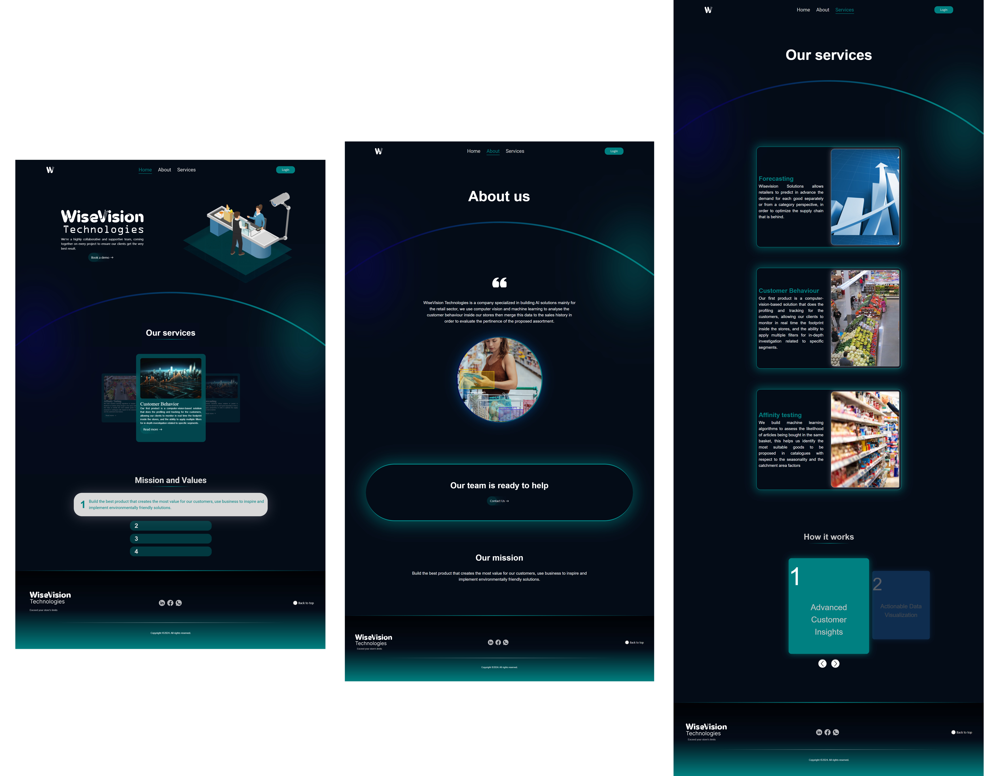
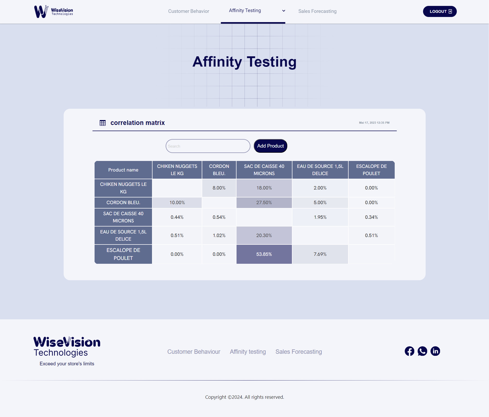
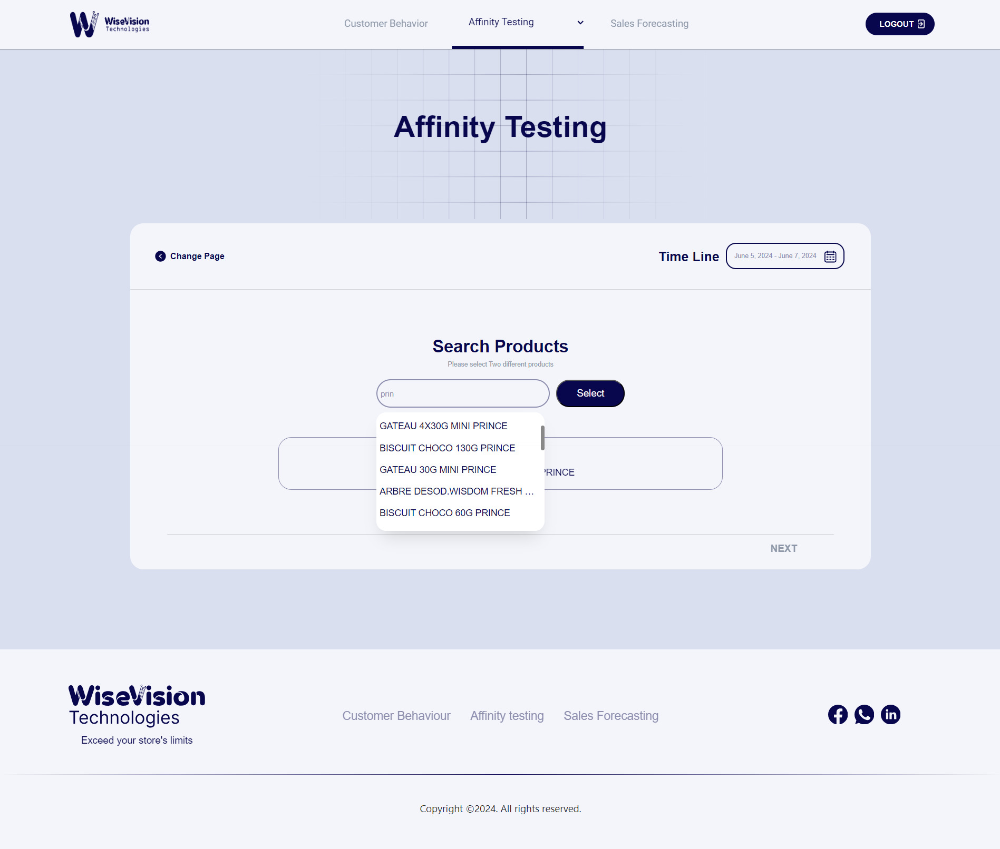
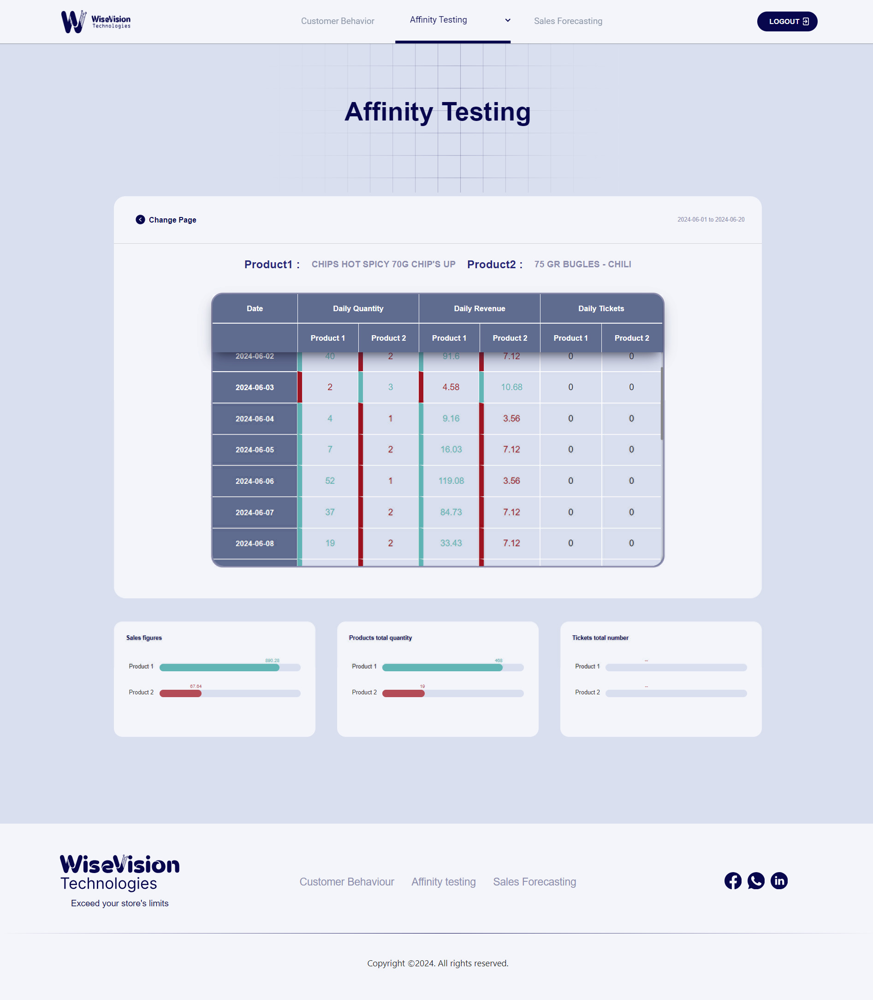
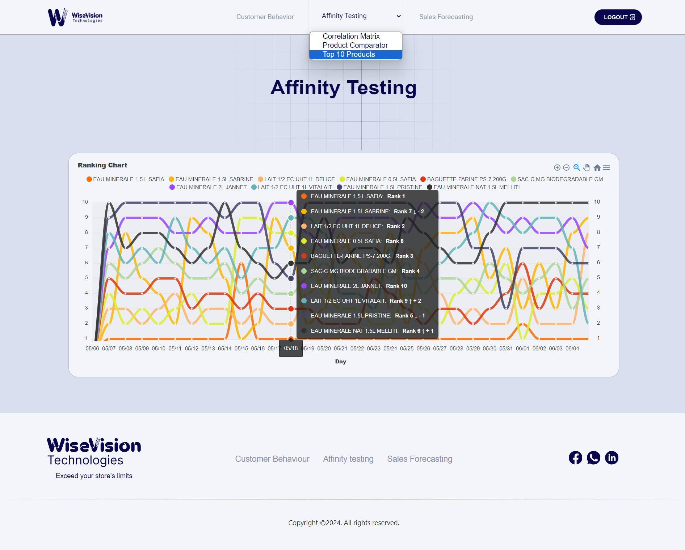
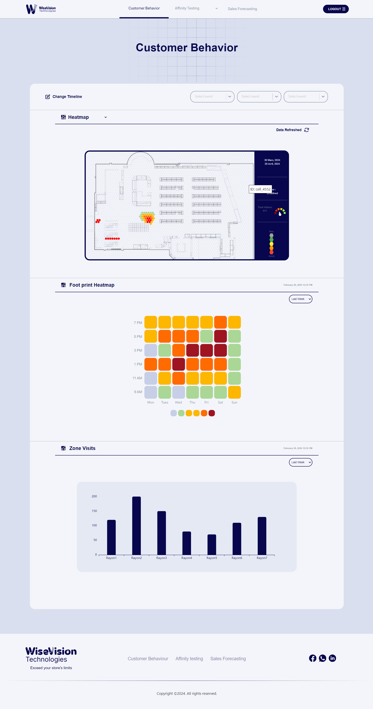
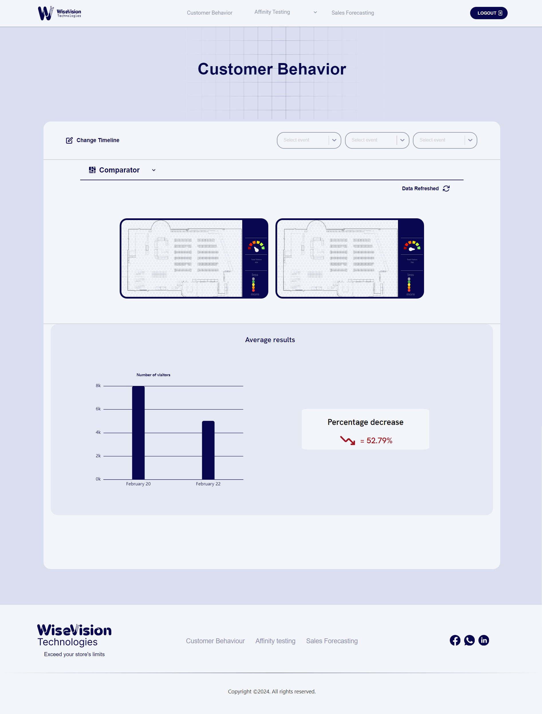
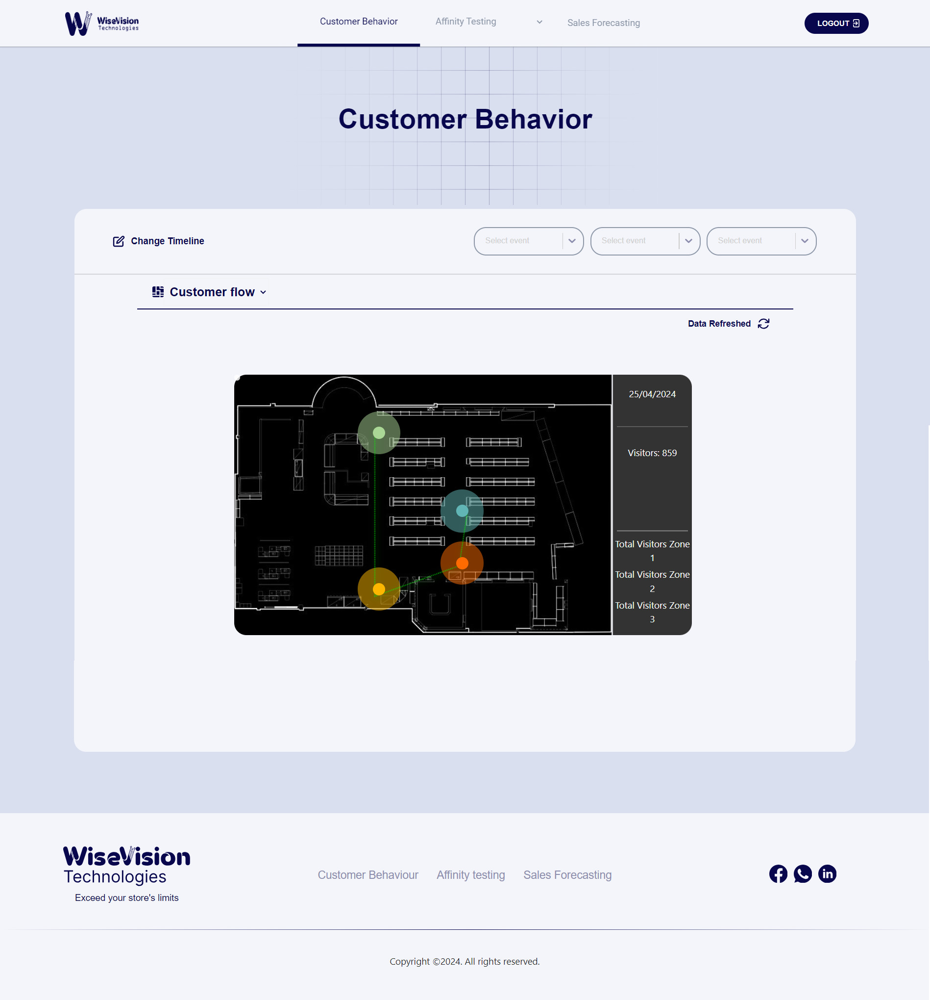

# My Final Year Project

Welcome to **My Github**, a system developed to help retail businesses analyze sales trends and customer behavior. This project is composed of a website and two primary components designed to provide actionable insights and improve store management. Below, you will find a comprehensive guide to the system, its features, and how to set it up.

---

## Features

### 1. Website of WiseVision Startup

A user-friendly website serves as the foundation for WiseVision's online presence. Key sections include:
- **Home**
- **About**
- **Services**



---

### 2. Affinity Testing System

The affinity testing module analyzes:
- **Product correlations**
- **Sales Performance comparator**
- **Popular items**

This provides retail vendors with valuable insights to optimize product placements and sales strategies.






---

### 3. Customer Behavior Analysis Tool

A front-end interface for analyzing customer behavior in retail stores. Features include:
- **Heatmaps** for high-traffic areas
- **Foot traffic footprints**
- **Bar charts**
- **Heatmap comparator**
- **Customer flow visualizations**

These tools help store managers:
- Improve store layouts
- Identify peak hours
- Monitor section popularity





---

## Technologies Used

- **Frontend:** React.js
- **Backend:** Spring Boot

---

## Setup Instructions

1. **Clone the Repository:**
   ```bash
   git clone https://github.com/Sheedii/End-of-study-project.git
   ```

2. **Frontend Setup:**
   - Navigate to the frontend directory:
     ```bash
     cd frontend
     ```
   - Install dependencies:
     ```bash
     npm install
     ```
   - Start the development server:
     ```bash
     npm start
     ```

3. **Backend Setup:**
   - Navigate to the backend directory.
   - Run the backend application using your preferred IDE or build tools.

**Note:**
This project does not include a database due to confidentiality restrictions. Certain features requiring data persistence will need dummy data to test functionality.

---

## Screenshots and Visuals
Images for each module have been provided above. These represent key functionalities and visual aspects of the system.

---


## License
This project is for educational purposes and is not intended for commercial use. Any usage must credit the author **WiseVision Startup**.

---

Thank you for exploring **My Github Repository**! We hope it provides valuable insights and tools for retail business management.

